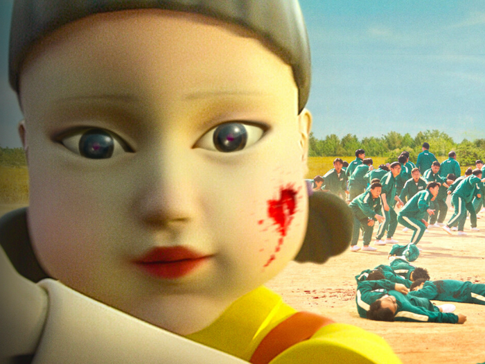

This game was created following this [freeCodeCamp tutorial](https://www.youtube.com/watch?v=4HSxX-EKJjw) 
to learn more about Javascript Three.js and to work and have fun with [friends](https://github.com/yka87)!

All credit goes to 
[Angel Brace](https://www.youtube.com/c/AngleBrace),
[freeCodeCamp](https://www.youtube.com/channel/UC8butISFwT-Wl7EV0hUK0BQ), and [Squid Game](https://www.google.com/search?q=squid+gamr&oq=squid+gamr&aqs=chrome..69i57j46i10i433j0i10i433l2j0i10j0i10i433l2j0i10j0i10i433.1821j0j7&sourceid=chrome&ie=UTF-8) creators!

---

✨ **Language used** : JavaScript Three.js ✨

### How to Play 🎮:

- Press the `right key` to move while the doll is looking _away_ from your player.
- Remove your finger from the `right key` when the doll is looking _at_ your player.
- Be careful of the countdown at the top! If your time runs out, you lose!

